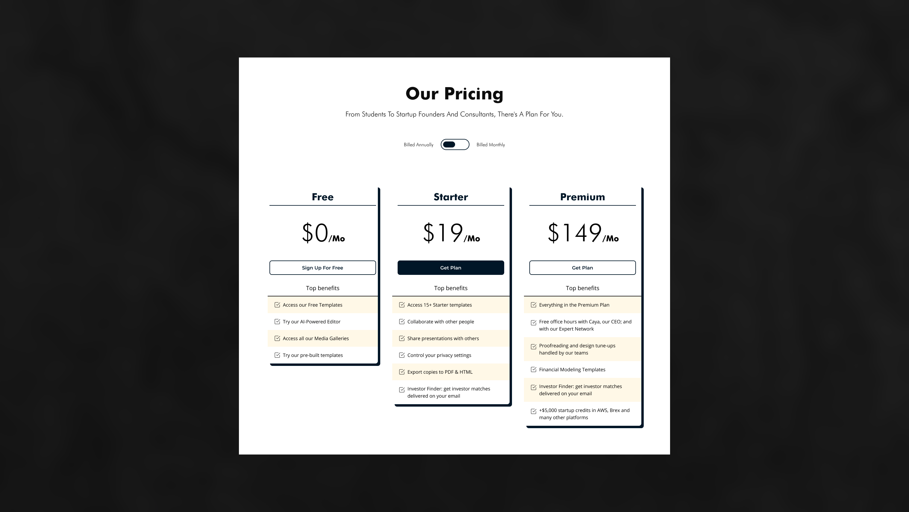

# Pricing page
Day 2 of UI designs that I do in HTML5 and CSS3

### Page 1

> font-color: 
> background-color: 
> dark-color:
> button-color:

### Page 2

> font-color: 
> background-color: 
> dark-color:
> button-color:

### Page 3

> font-color: 
> background-color: 
> dark-color:
> button-color:

### Page 4

> font-color: 
> background-color: 
> dark-color:
> button-color:

### Page 5

> font-color: 
> background-color: 
> dark-color:
> button-color:

### Page 6

> font-color: 
> background-color: 
> dark-color:
> button-color:

### Page 7

> font-color: 
> background-color: 
> dark-color:
> button-color:

### Page 8

> font-color: 
> background-color: 
> dark-color:
> button-color:

### Page 9

> font-color: 
> background-color: 
> dark-color:
> button-color:

### Page 10

> text-color: 
> background-color: 
> dark-color:
> button-color:

### Page 11

> font-color: 
> background-color: 
> dark-color:
> button-color:

### Page 12

> font-color: 
> background-color: 
> dark-color:
> button-color:

### Page 13

> font-color: 
> background-color: 
> dark-color:
> button-color:

### Page 14

> font-color: 
> background-color: 
> dark-color:
> button-color:

### Page 15

> font-color: 
> background-color: 
> dark-color:
> button-color:

