# Pricing page
Day 2 of UI designs that I do in HTML5 and CSS3

### Page 1

> font-color: #fff white
> background-color:  #282828 #333 darkslategray hsl(0,0%,15%) rgb(40,40,40)
> dark-color: #202020 #222 black hsl(0,0%,12%) rgb(32,32,32)
> button-color: white , font-in-button: #282828 #333  darkslategray hsl(0,0%,15%) rgb(40,40,40)

### Page 2
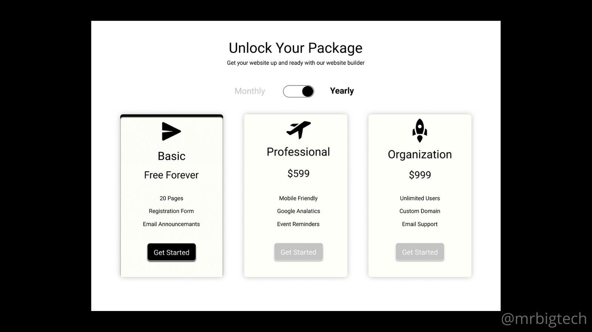

> font-color: 
> overall-background-color: #000000 #000 black hsl(0,0%,0%) rgb(0,0,0)
> background-color: #fff
> light-color: #bcbdb7 #ccb silver hsl(69,4%,72%) rgb(188,189,183)
> icon-color: #0c0d0a #111 black hsl(80,13%,4%) rgb(12,13,10)
> button-color: #c3c3c3 #ccc silver hsl(0,0%,76%) rgb(195,195,195)

### Page 3
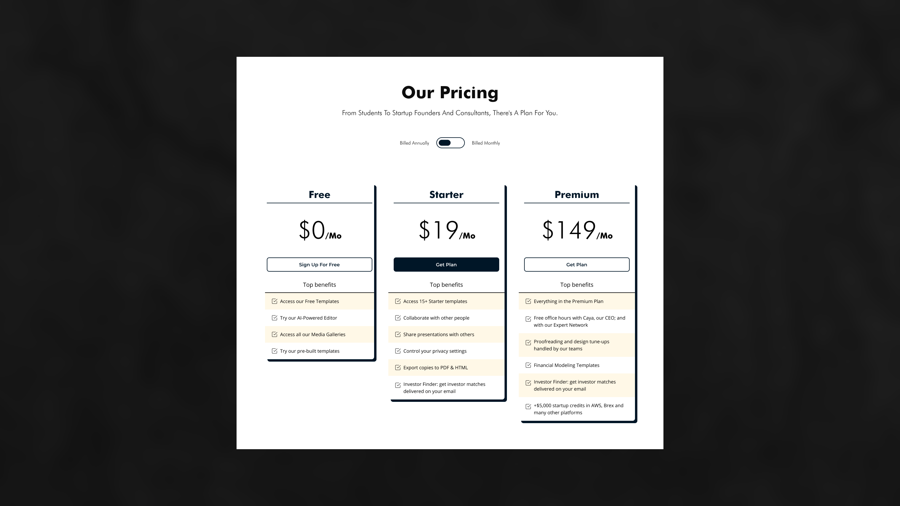

> font-color: 
> background-color: #161616 #111 black hsl(0,0%,8%) rgb(22,22,22)
> dark-color:
> button-color: #001627 #012 black hsl(206,100%,7%) rgb(0,22,39)

### Page 5
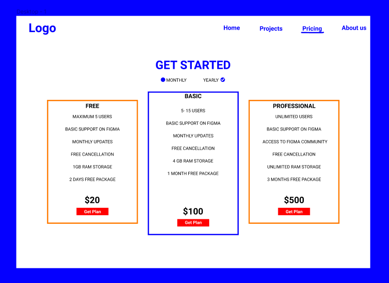

> font-color: 
> background-color: 
> dark-color:
> button-color:

### Page 6
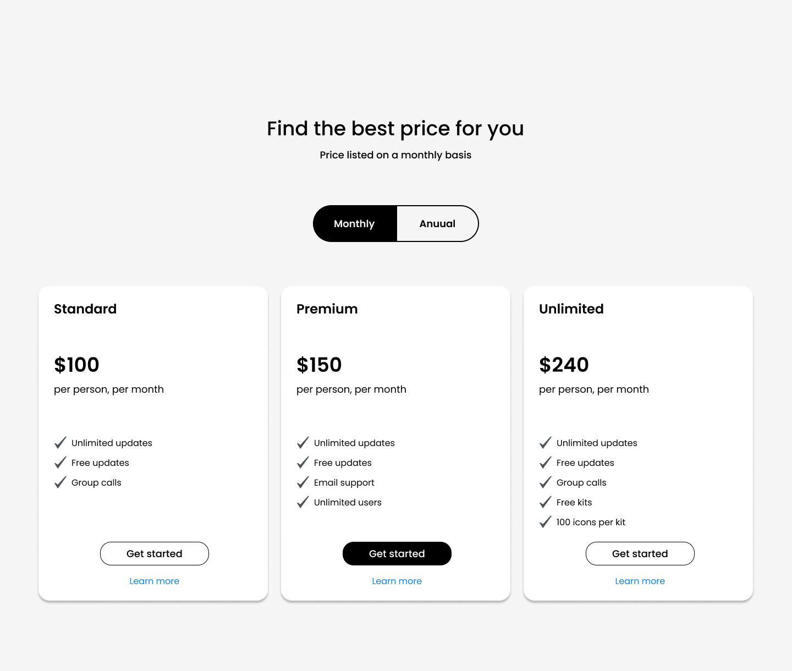

> font-color: 
> background-color: 
> dark-color:
> button-color:

### Page 7
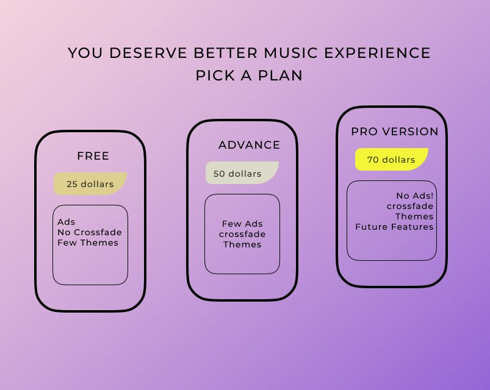

> font-color: 
> background-color: 
> dark-color:
> button-color:

### Page 8
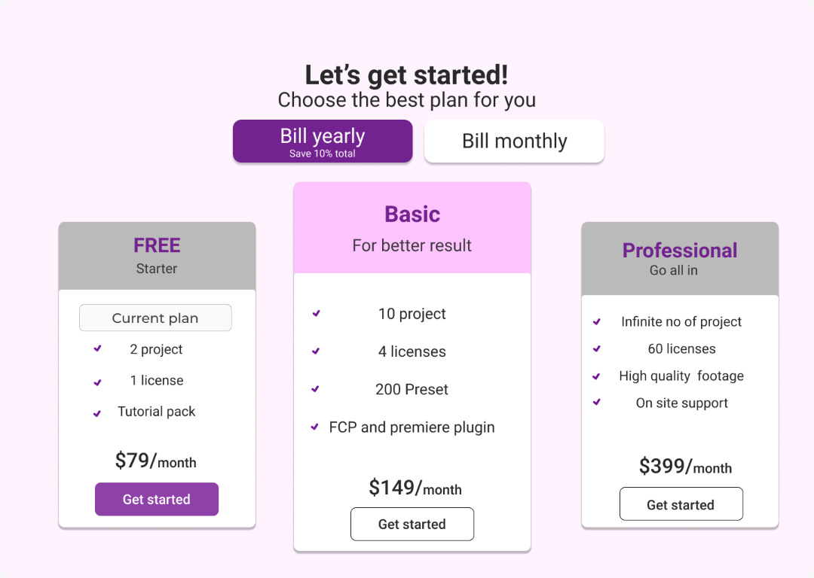

> font-color: 
> background-color: 
> dark-color:
> button-color:

### Page 9
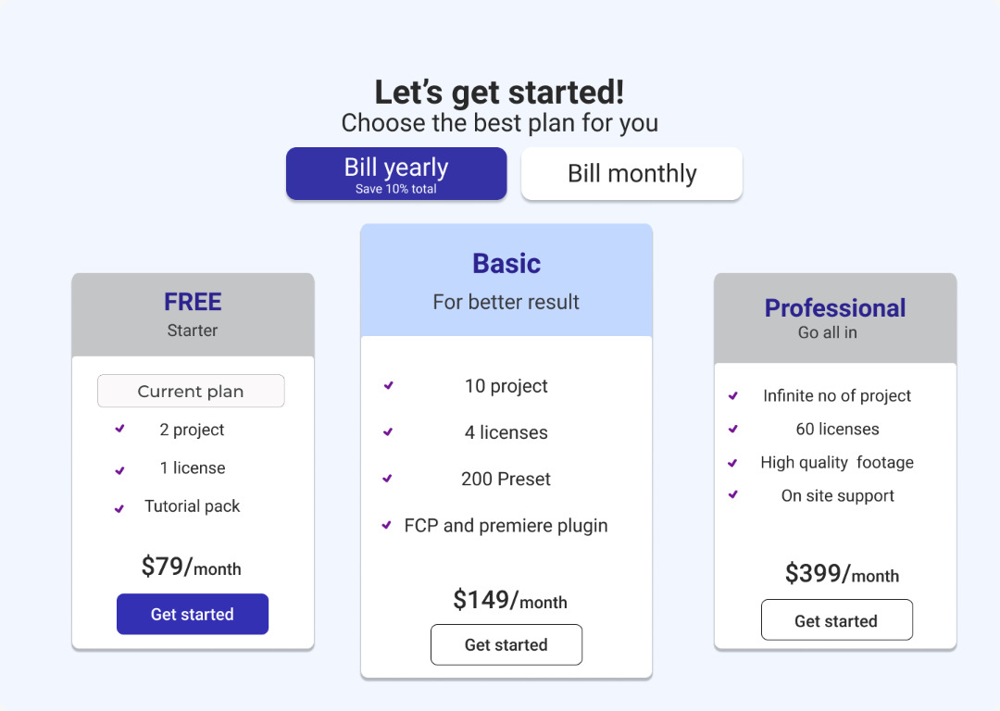

> font-color: 
> background-color: 
> dark-color:
> button-color:

### Page 10
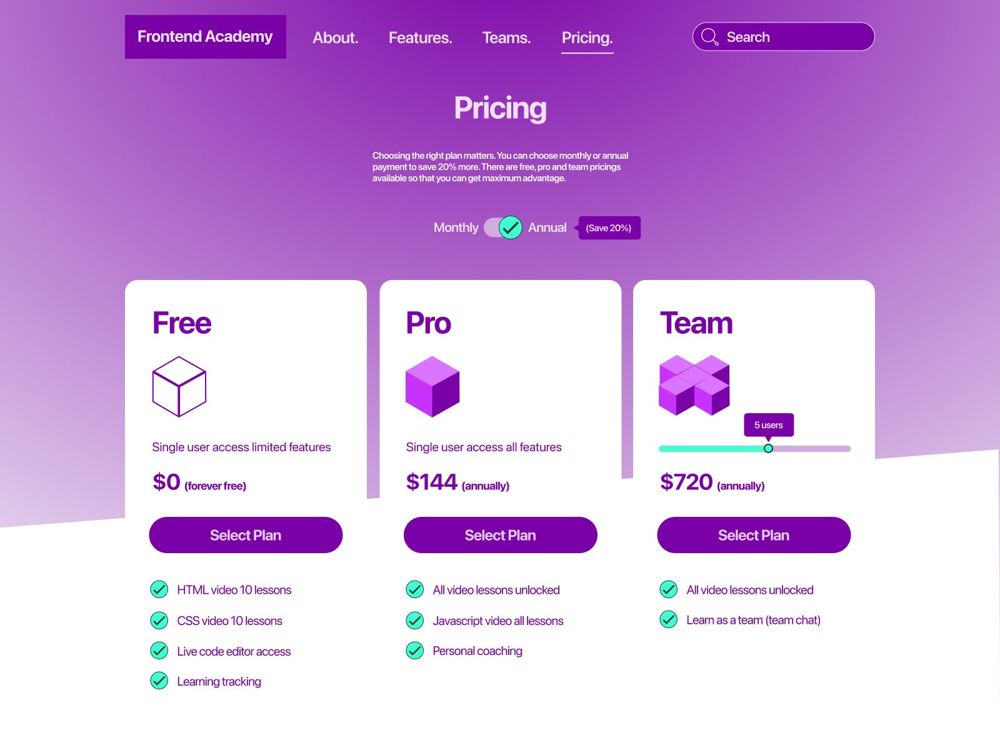

> text-color: 
> background-color: 
> dark-color:
> button-color:

### Page 11

> font-color: 
> background-color: 
> dark-color:
> button-color:

### Page 12
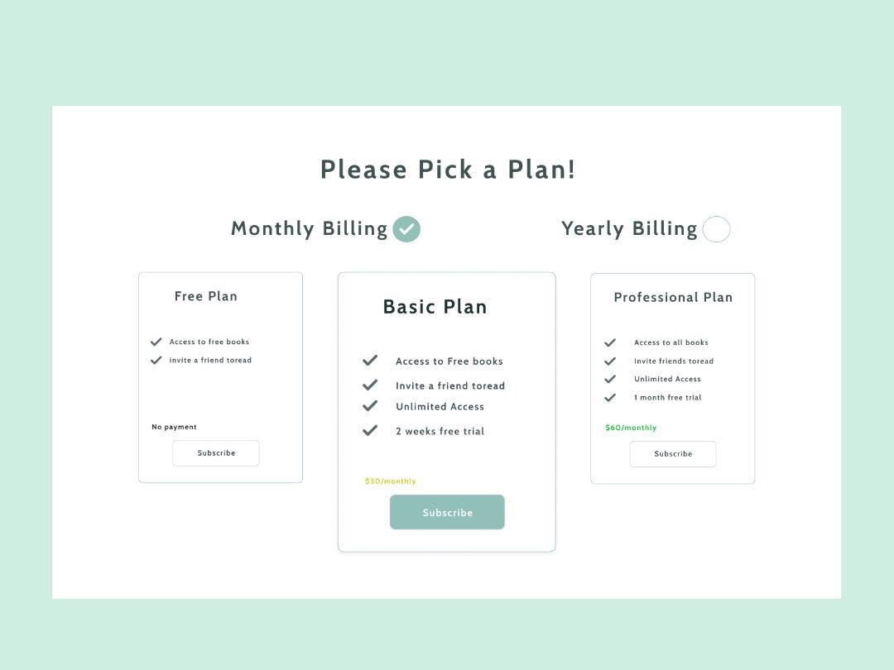

> font-color: 
> background-color: 
> dark-color:
> button-color:

### Page 13
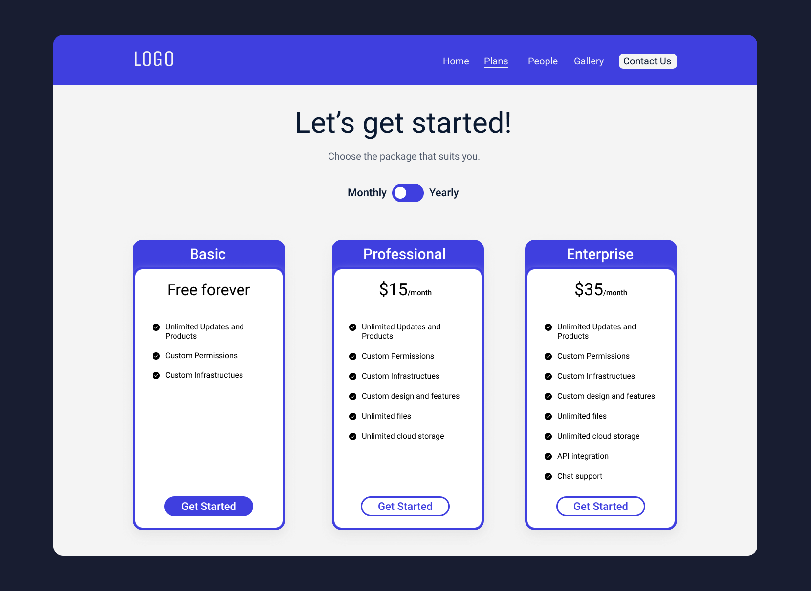

> font-color: 
> background-color: 
> dark-color:
> button-color:

### Page 14
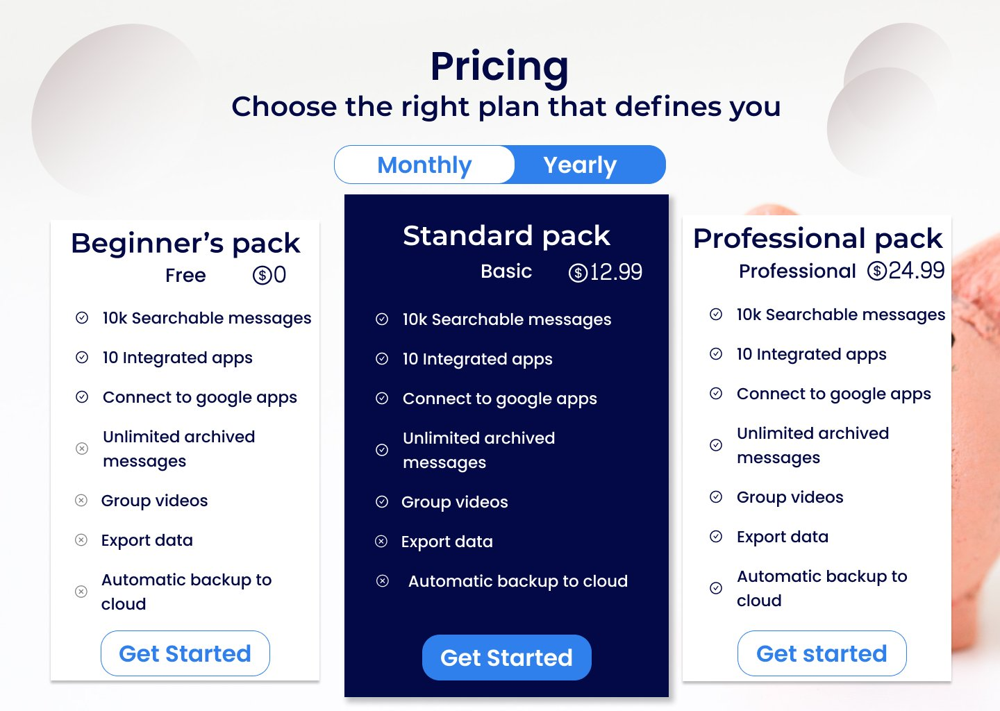

> font-color: 
> background-color: 
> dark-color:
> button-color:

### Page 15
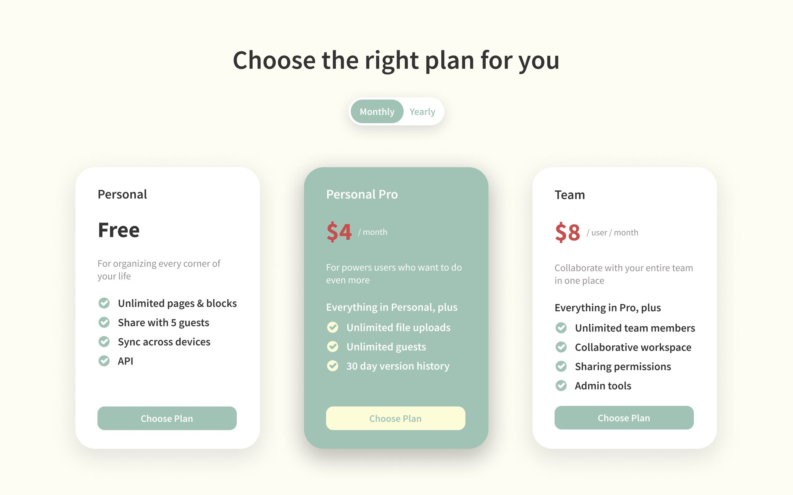

> font-color: 
> background-color: 
> dark-color:
> button-color:

